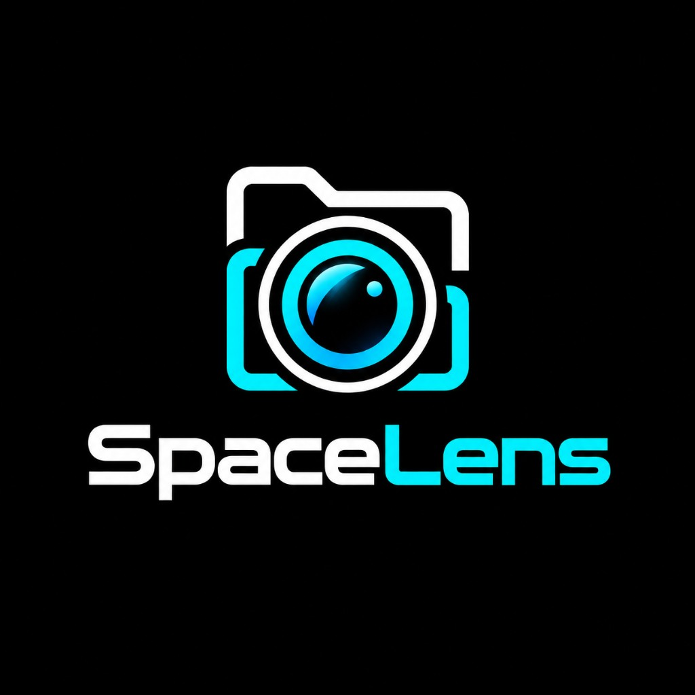
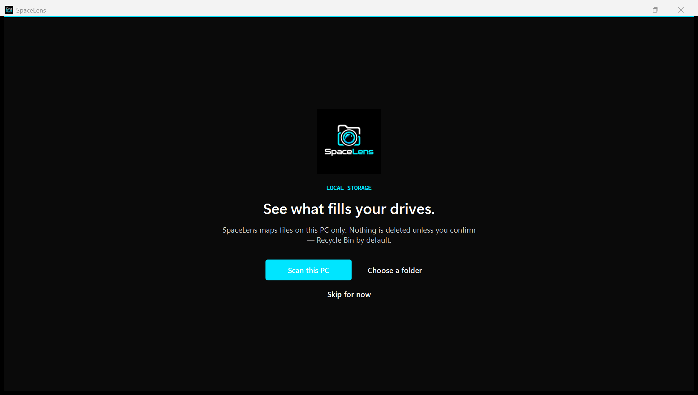
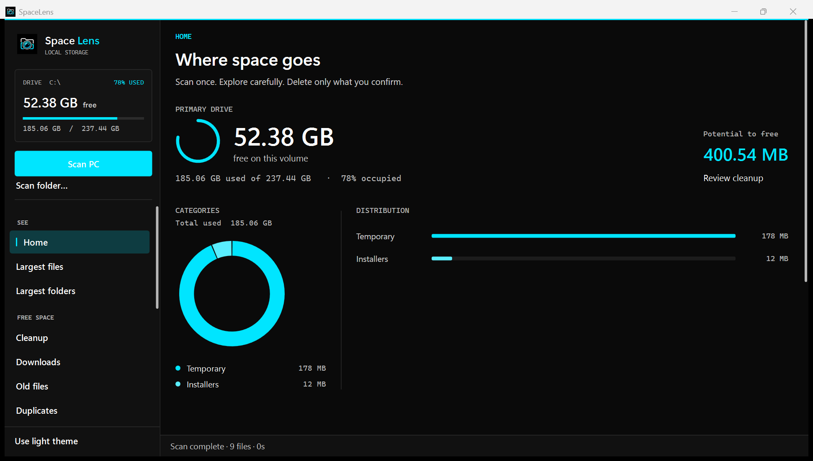
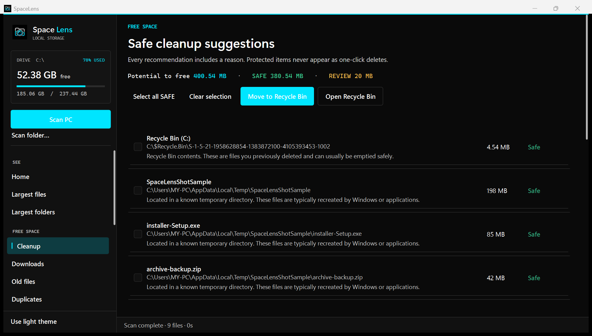
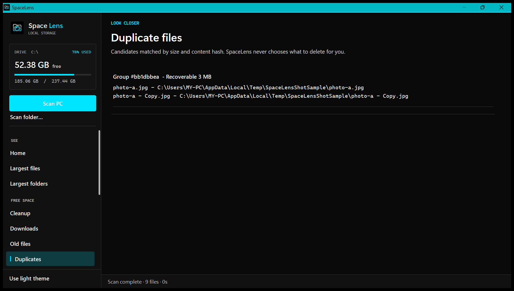

# SpaceLens

<p align="center">
  
</p>

<p align="center">
  <strong>Understand your storage. Clean it safely.</strong>
</p>

<p align="center">
  Windows desktop storage analyzer + cleanup assistant<br/>
  Local-only · Transparent risk labels · Recycle Bin by default
</p>

<p align="center">
  <a href="https://github.com/AWM-OFFICIAL/SpaceLens/releases/latest"></a>
  
  
</p>

---

## What is SpaceLens?

SpaceLens is a **Windows app** that shows what is filling your drives, explains why, and helps you free space **without surprise deletes**.

| It does | It does **not** |
|---------|-----------------|
| Scan your PC or a chosen folder | Upload your files or paths to the cloud |
| Map largest files, folders, Downloads, duplicates | Uninstall applications for you |
| Label items **SAFE / REVIEW / PROTECTED / UNKNOWN** | One-click wipe protected system or personal folders |
| Suggest cleanup you confirm yourself | Require an account or telemetry |

**Default cleanup:** move to the Windows **Recycle Bin**. Permanent delete needs two confirmations.

---

## Screenshots

| Welcome | Overview |
|---------|----------|
|  |  |

| Cleanup | Duplicates |
|---------|------------|
|  |  |

More shots: [marketing/screenshots](marketing/screenshots).

---

## Download (recommended for most people)

1. Open **[Releases → Latest](https://github.com/AWM-OFFICIAL/SpaceLens/releases/latest)**
2. Download **`SpaceLens-Windows-x64.zip`**
3. Unzip the folder
4. Double-click **`Setup.bat`**
5. SpaceLens installs to `%LocalAppData%\Programs\SpaceLens` and creates Desktop + Start Menu shortcuts
6. Launch **SpaceLens** and click **Scan this PC** (or choose a folder)

> **What you are downloading:** a self-contained Windows x64 build of SpaceLens plus a setup script. No installer wizard, no admin required for a normal install. Your files stay on this PC.

### Portable use (no install)

Unzip and run `App\SpaceLens.exe` directly. Shortcuts will not be created.

### Uninstall

After install, run:

`%LocalAppData%\Programs\SpaceLens\Uninstall.ps1`

Or from this repo:

```powershell
powershell -ExecutionPolicy Bypass -File scripts\Uninstall-DesktopApp.ps1
```

Add `-RemoveUserData` to also delete settings/history under `%LocalAppData%\SpaceLens`.

---

## Requirements

| Users (download zip) | Developers (build from source) |
|----------------------|--------------------------------|
| Windows 10 or 11 (64-bit) | Windows 10/11 + [.NET 8 SDK](https://dotnet.microsoft.com/download/dotnet/8.0) |
| No separate .NET install needed for the release zip (self-contained) | Visual Studio or `dotnet` CLI |

---

## Quick start after install

1. **Scan this PC** (or **Scan folder…** for a faster look)
2. On **Home**, see where space goes and potential cleanup
3. Open **Cleanup** — read the reason on each suggestion
4. Select items → **Move to Recycle Bin** → confirm
5. Restore anything from the Windows Recycle Bin if needed

**Window controls:** Minimize keeps SpaceLens on the taskbar. **Close (X)** exits the app. You can also quit from **Settings → Exit SpaceLens**.

---

## Privacy

- Analysis runs **only on your computer**
- **No cloud upload** of file metadata or contents
- **No telemetry by default**
- Optional local history stores sizes and category totals only — not file contents
- Open or clear local data from **Privacy** in the app (`%LocalAppData%\SpaceLens`)

---

## Safety model

| Risk | Meaning |
|------|---------|
| **SAFE** | Known temp / cache / regeneratable data |
| **REVIEW** | Likely removable — needs your judgment |
| **PROTECTED** | System, Program Files, personal documents — never one-click delete |
| **UNKNOWN** | Not confidently classified — never treated as SAFE |

Protected roots include Windows, System32, Program Files, boot/page/hiber files, credential stores, and user-profile special folders.

---

## Features

- Full PC or folder scans with live progress
- Largest files & folders
- SAFE / REVIEW cleanup suggestions
- Downloads, old/untouched files
- Duplicate detection (size + content hash)
- Development artifacts (`node_modules`, build caches, …)
- Application storage estimates (analysis only — does not uninstall apps)
- Local scan history charts
- Dark / light theme
- Export reports (HTML / JSON / CSV) with a privacy warning
- Optional **Run as administrator** (standard UAC) for restricted folders

---

## Build from source (developers)

```powershell
git clone https://github.com/AWM-OFFICIAL/SpaceLens.git
cd SpaceLens
dotnet build SpaceLens.sln -c Release
dotnet run --project src\SpaceLens\SpaceLens.csproj
```

Install from source (framework-dependent publish + shortcuts):

```powershell
powershell -ExecutionPolicy Bypass -File scripts\Install-DesktopApp.ps1
```

Self-contained publish:

```powershell
dotnet publish src\SpaceLens\SpaceLens.csproj -c Release -r win-x64 --self-contained true -o publish-standalone
```

Tests:

```powershell
dotnet test SpaceLens.sln
```

### Architecture

| Project | Role |
|---------|------|
| `SpaceLens.Core` | Models, classification, risk engine, settings |
| `SpaceLens.Scanner` | Filesystem scan, duplicates, cleanup, reports |
| `SpaceLens` | WPF UI (MVVM) |
| `SpaceLens.Tests` | Safety and unit tests |

Deeper notes: [docs/ARCHITECTURE.md](docs/ARCHITECTURE.md) · store listing draft: [marketing/store/STORE-LISTING.txt](marketing/store/STORE-LISTING.txt)

---

## How permissions work

- Runs as a normal user by default (`asInvoker`)
- Access-denied folders are recorded; the scan continues
- **Settings → Run as administrator** relaunches via the standard Windows UAC prompt
- SpaceLens never bypasses UAC

---

## Limitations

- Application detection is heuristic (path matching), not an uninstaller
- Duplicate hashing uses a fast size + partial-content hash for large files
- Full PC scans of millions of files can take a long time — use folder scans for quicker results
- Some folders need elevation to read; SpaceLens reports them rather than crashing

---

## License

[MIT](LICENSE) — includes CommunityToolkit.Mvvm (MIT).

---

<p align="center">
  <a href="https://github.com/AWM-OFFICIAL/SpaceLens/releases/latest"><strong>Download the latest release →</strong></a>
</p>
